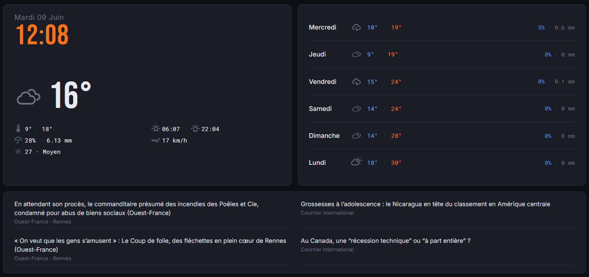

# dashboard

[![CC BY 4.0][cc-by-shield]][cc-by]

Licensed under a [Creative Commons Attribution 4.0 International License][cc-by].

[![CC BY 4.0][cc-by-image]][cc-by]

[cc-by]: http://creativecommons.org/licenses/by/4.0/
[cc-by-image]: https://i.creativecommons.org/l/by/4.0/88x31.png
[cc-by-shield]: https://img.shields.io/badge/License-CC%20BY%204.0-lightgrey.svg

---

A lightweight, self-refreshing information dashboard designed for a fixed display in a living room, running on a Raspberry Pi. No server, no framework — just a Python data fetcher and a static HTML page.



## Features

- **Current weather** — temperature, wind speed, precipitation probability, sunrise/sunset times, weather icon (WMO code)
- **6-day forecast** — daily min/max temperatures, weather icon, rain probability and accumulation
- **Air quality** — real-time European AQI with colour-coded label (green → amber → red)
- **News feed** — 2×2 grid: 2 local headlines (Ouest-France, Rennes) and 2 world headlines (Courrier International), full titles, no truncation
- **Live clock** — refreshes every 30 seconds without reloading the page

## File structure

```
dashboard/
├── data/
│   └── dashboard.json     # generated by update.py, read by app.js
├── venv/                  # Python virtual environment (created by install.sh)
├── .firefox-profile/      # Firefox profile for local file access (created by start.sh)
├── app.js                 # Renders dashboard.json into the three panels
├── index.html             # Page shell; loads fonts, Weather Icons, app.js
├── style.css              # Dark theme, CSS tokens, responsive layout
├── update.py              # Fetches weather + news, writes dashboard.json
├── install.sh             # One-time setup (venv + dependencies)
├── start.sh               # Main launcher (data fetch + browser + refresh loop)
├── dashboard.desktop      # Double-click entry point for the file manager
└── start.log              # Runtime log written by start.sh (auto-created)
```

## How it works

`update.py` calls two free APIs (no key required):

- [Open-Meteo](https://open-meteo.com/) — weather forecast and current conditions
- [Open-Meteo Air Quality](https://open-meteo.com/en/docs/air-quality-api) — European AQI

It also parses two RSS feeds:

- `rennes.maville.com` — local Rennes news (Ouest-France)
- `courrierinternational.com` — world news

All data is written to `data/dashboard.json`. `app.js` fetches that file on page load and renders the three panels. The page itself never makes network requests — all external calls go through `update.py`.

`start.sh` orchestrates the full lifecycle: it runs `update.py` once on startup, opens the browser in kiosk mode, then re-runs `update.py` every 15 minutes in a loop and reloads the page (via `xdotool`).

## Requirements

- Raspberry Pi running Raspberry Pi OS (or any Debian-based Linux)
- Python 3.7+
- Firefox or Chromium
- Internet connection (for APIs, RSS feeds, and CDN-hosted fonts and icons)

Optional but recommended for automatic page reload:
```bash
sudo apt install xdotool
```

## Installation

**Run once**, from inside the project directory:

```bash
cd ~/dashboard
bash install.sh
```

This creates the `venv/` folder, installs `requests` and `feedparser`, and generates the first `dashboard.json`.

## Usage

**Edit `dashboard.desktop`** and replace the path with the actual location of your project:

```
Exec=bash /home/your-username/dashboard/start.sh
```

Then make it executable (right-click → *Allow executing* in the file manager, or):

```bash
chmod +x dashboard.desktop
```

**Double-click `dashboard.desktop`** to launch. The dashboard will open full-screen and refresh automatically every 15 minutes.

All runtime output is logged to `start.log` in the project directory — useful for troubleshooting.

## Configuration

To use a different location, edit the coordinates at the top of `update.py`:

```python
LAT      = 48.1173        # latitude
LON      = -1.6778        # longitude
TIMEZONE = "Europe/Paris" # IANA timezone name
```

To change the refresh interval, edit `INTERVAL` in `start.sh` (value in seconds):

```bash
INTERVAL=900  # 15 minutes
```

To add or replace news sources, edit the `news` dict in `update.py` and update the matching key lookups in `app.js`:

```python
news = {
    "Rennes (Ouest France)":          rss_titles("https://..."),
    "Monde (Courrier international)": rss_titles("https://..."),
}
```

## Design

- **Fonts** (Google Fonts CDN): Bebas Neue (clock, large temperatures), Inter (body), Roboto Mono (numeric values in forecast)
- **Icons**: [Weather Icons 2.0.10](https://erikflowers.github.io/weather-icons/) via cdnjs — mapped from WMO 4677 weather codes
- **Colour palette**: near-black background (`#0d0f14`), orange accent for warm values (`#f97316`), blue for cold/rain (`#60a5fa`), semantic colours for AQI
- **Layout**: CSS Grid, two columns on top + full-width strip at the bottom; responsive single-column below 900px